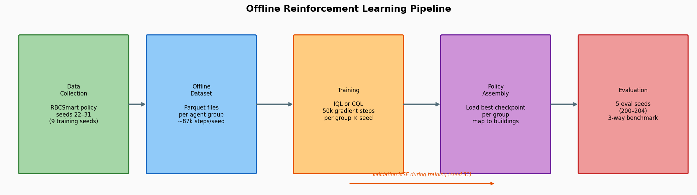
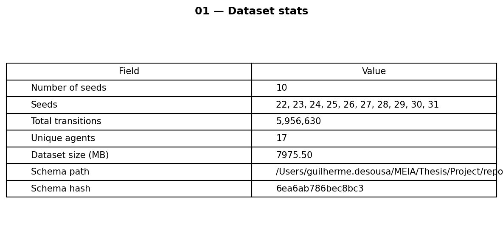
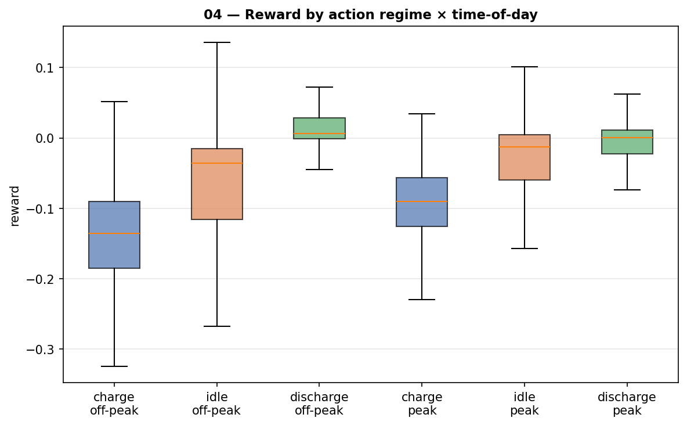
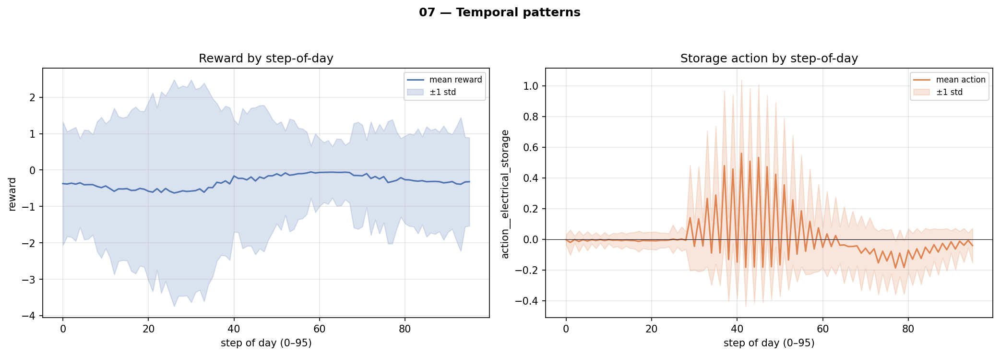
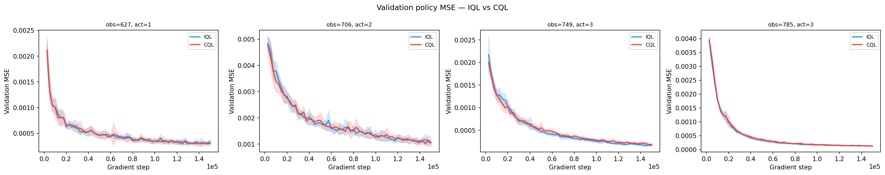
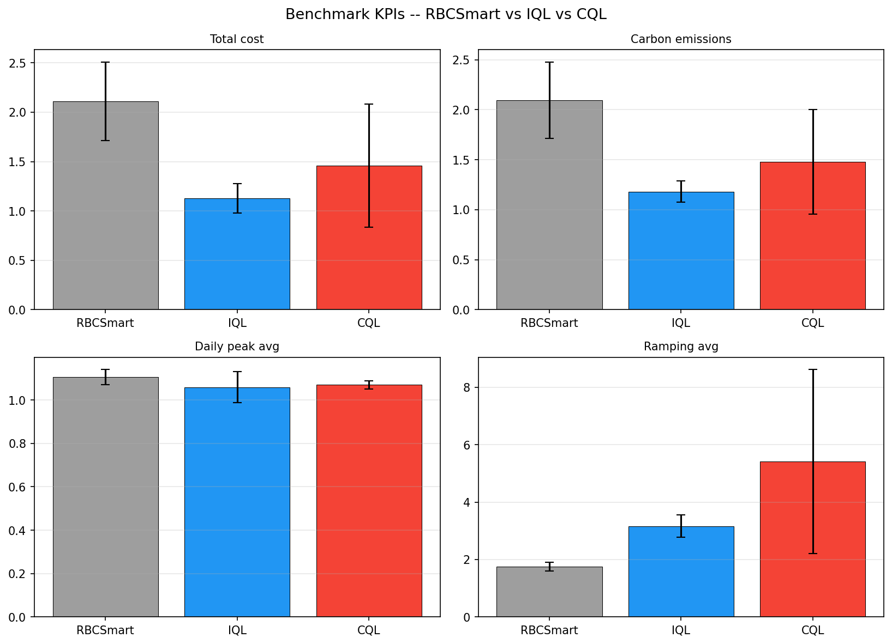
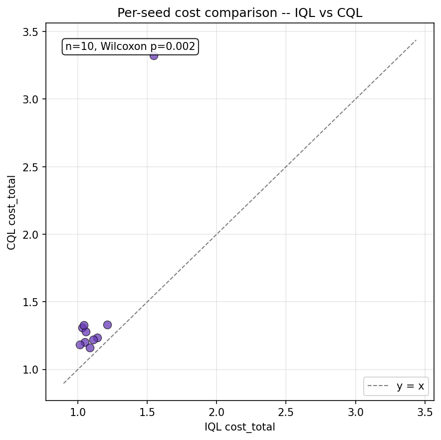

# IQL + CQL 15-min Initiative — Engineering Note

> **Status:** Implementation note (production in flight; numbers marked
> `<!-- TBD: production -->` will be filled in during Phase 12).
> **Branch:** `feature/offline-agents-implementation`.
> **Parent plan:** [`iql_cql_initiative_plan.md`](iql_cql_initiative_plan.md).
> **Spec:** [`phase11_consolidated_doc_design.md`](phase11_consolidated_doc_design.md).
> **Date drafted:** 2026-06-22.

This document is a self-contained engineering note for the offline-RL
initiative that takes the Building-5-only iteration (recorded in
[`thesis_notes.md`](thesis_notes.md)) to all 17 buildings on the 15-min
CityLearn schema, using IQL and CQL trained from RBCSmart rollouts.
It is the repo deliverable; the thesis treatment lives in Ch4-Ch6.

---

## Table of contents

1. [Motivation & scope](#1-motivation--scope)
2. [Dataset](#2-dataset)
3. [Algorithms (IQL + CQL)](#3-algorithms-iql--cql)
4. [Resume & status visibility](#4-resume--status-visibility)
5. [Engineering — the CityLearn OOM](#5-engineering--the-citylearn-oom)
6. [Training setup](#6-training-setup)
7. [Benchmark results](#7-benchmark-results)
8. [Feature analysis highlights](#8-feature-analysis-highlights)
9. [Reproducing](#9-reproducing)
10. [Limitations](#10-limitations)
11. [References](#11-references)

---

## 1. Motivation & scope

The Building-5-only iteration recorded in [`thesis_notes.md`](thesis_notes.md) worked: BC beat its RBC teacher by ~3% on Building-5 `cost_total`, and IQL pushed further while keeping `unserved_energy` at zero. The catch was scope. With one learned building inside a 17-building district, any local gain was diluted ~17× before it reached district KPIs, so the only honest evaluation target was Building-5 performance. This initiative closes that gap by training across all 17 buildings, which makes district-level KPIs the meaningful comparison surface for the first time.

**Why offline RL.** Training never touches the live environment. The cost, carbon, peak, ramp, and unserved-energy constraints baked into the reward are precisely the ones that make exploratory online learning unsafe on real infrastructure; offline RL sidesteps that risk entirely. The data we need already exists — RBCSmart rollouts, the same controller class used in the Building-5 study — and the deployment story matches the training story: a trained policy hot-swaps into the dispatcher without disturbing the live grid.

**Why IQL and CQL.** Both algorithms address the same failure mode (querying the Q-function on out-of-distribution actions) with structurally different defences. IQL avoids OOD queries by construction: its expectile-regressed V-function is only ever evaluated on dataset actions, and the policy is extracted by advantage-weighted regression on the same support (*Offline Reinforcement Learning with Implicit Q-Learning*, Kostrikov et al. 2021). CQL keeps the standard actor-critic loop but adds a conservative penalty that pushes Q-values down on OOD actions (*Conservative Q-Learning for Offline Reinforcement Learning*, Kumar et al. 2020). Running both on the same data lets us compare these two OOD defences head to head.

**Why 15-min, not 15-sec.** The CityLearn schema ships in two cadences. The 15-sec variant gives 5760 steps/day × 365 = ~2.1M steps per seed-year — finer-grained, but intractable for CPU-only training over 10 seeds. The 15-min variant gives 96 steps/day × 365 = 35040 steps per seed-year, roughly 17× smaller. EV charging dynamics live at the ~10s to ~1h scale, so 15-min still resolves the control loop adequately; the trade-off buys hours-per-seed instead of days-per-seed for collection, and keeps the full multi-seed pipeline within an overnight budget.

**Why this initiative now.** The full multi-building run only became feasible after Phases 1-8 of the parent plan landed: per-stage sentinels, atomic checkpoints, `status.json` progress reporting, and a single resumable orchestrator that survives crashes mid-collection or mid-training. Without that scaffolding, a 10-seed × 17-building run would be one fragile process away from restarting from scratch.

<!-- TBD: production -->


The rest of this note walks the pipeline from data to results.

---

## 2. Dataset

The corpus is a single RBCSmart rollout per seed, ten seeds (22-31), 35040 steps each — one full year of 15-min control. Every per-step row carries all 17 buildings' observations, the actions issued by RBCSmart to each charger and battery, and a per-agent reward computed live (rather than reconstructed after the fact). Across the ten seeds that is roughly 350k transitions, written to `runs/offline_iql_cql_initiative_15min/data/seed_<N>.parquet`. The collection run is the longest single stage in the pipeline; everything downstream reads parquet only.

**Schema and provenance.** The simulation schema is `datasets/citylearn_three_phase_electrical_service_demo_15min_parquet/schema.json`; the column layout (observation names, action keys, per-building groupings, reward column) is documented in [`dataset_schema.md`](dataset_schema.md). Each seed parquet is stamped with a `schema_hash` field that pins the data to the exact schema it was generated from, so a downstream training run that loads a parquet with a mismatched hash fails fast. When the collect stage finishes a seed it appends an entry to `manifest.json` (per-seed row counts, mean and tail KPIs, schema hash, RBCSmart variant) and updates `kpi_summary.csv`; when all ten seeds complete, it writes a `.collect.done` sentinel that the orchestrator uses to skip the stage on resume.

**Entity interface and agent groups.** CityLearn's *entity interface* returns per-building observations as a dict-of-arrays keyed by building, replacing the legacy flat-vector layout where every building's features were concatenated. This matters because the 17 production buildings do not share a common observation shape: they have different EV configurations, different battery setups, and different metering, which collapses into four unique `(obs_dim, action_dim)` cohorts.

| Group key       | Buildings | obs_dim | action_dim | Notes                                  |
|-----------------|----------:|--------:|-----------:|----------------------------------------|
| `obs627_act1`   | 10        | 627     | 1          | 10-building cohort, headline cohort     |
| `obs706_act2`   | 5         | 706     | 2          | 5-building cohort                       |
| `obs749_act3`   | 1         | 749     | 3          | singleton                               |
| `obs785_act3`   | 1         | 785     | 3          | singleton                               |

Each group is trained as its own model. This matches CityLearn's per-building agent contract and avoids the alternative — zero-padding heterogeneous shapes into a single wide tensor — which would let the network learn around padded slots in ways that do not transfer at deployment.

**Reward.** The per-agent reward column stores `CostServiceCommunityFeasiblePrecisionRewardV46` captured **live** during collection, not synthesised from KPIs after the rollout. This preserves the exact reward signal that any subsequent online comparison would see and removes a class of reconstruction bugs. The term-by-term breakdown, the design rationale, and the calibration history (the Building-5 iteration's NNLS fit plus the hybrid-floor rule that handles collinear KPI terms) are recorded in [`reward_design.md`](reward_design.md); both still apply unchanged for the multi-building data, with no per-building re-tuning.

<!-- TBD: production -->


<!-- TBD: production -->


<!-- TBD: production -->


<!-- TBD: production -->


For the full exploratory analysis see [`feature_analysis/feature_analysis.md`](feature_analysis/feature_analysis.md); §8 of this note summarises the three insights from that EDA that matter for IQL and CQL training.

---

## 3. Algorithms (IQL + CQL)

**IQL recap.** Implicit Q-Learning splits the offline value problem across three networks. A value function `V(s)` is trained with an asymmetric expectile loss at `τ=0.7`, which biases `V` toward the higher-return actions actually present in the data — without ever asking the network to score an action it has not seen. A twin Q is trained against `V(s')` as its bootstrap target, so the standard `max_a Q(s', a)` step (the classic source of OOD over-estimation in offline RL) never executes. The policy is then extracted by advantage-weighted regression with temperature `β=3.0` and an advantage clip of 100, upweighting transitions where the dataset action did better than `V`. For the full derivation see [`iql_reference.md`](iql_reference.md).

**CQL recap.** Conservative Q-Learning keeps a standard actor-critic loop and adds a regulariser — `α · ( E_{s∼D, a∼OOD}[Q(s, a)] − E_{(s,a)∼D}[Q(s, a)] )` — that pushes Q down on OOD actions and up on dataset actions. The penalty weight `α=0.2` is the same value the Building-5 iteration settled on; small enough to avoid over-pessimism (which would collapse the policy onto a narrow band of high-conviction actions and undo CQL's purpose) but large enough to noticeably re-shape Q on the OOD side.

| Parameter | IQL | CQL | Source |
|-----------|----:|----:|--------|
| Hidden layers | [256, 256] | [256, 256] | `--hidden-layers 256,256` |
| Dropout | 0.1 | 0.1 | trainer default |
| Activation | ReLU | ReLU | trainer default (hardcoded in `iql_networks.py`) |
| Optimiser | Adam | Adam | trainer default (`torch.optim.Adam`) |
| Learning rate | 3e-4 | 3e-4 | trainer default |
| Batch size | 256 | 256 | trainer default |
| γ (discount) | 0.99 | 0.99 | trainer default |
| Target soft-update τ | 0.005 | 0.005 | trainer default |
| Gradient clip | 1.0 | 1.0 | trainer default |
| Expectile τ (V loss) | 0.7 | — | IQL only |
| β (AWR temp) | 3.0 | — | IQL only |
| Advantage clip | 100 | — | IQL only |
| CQL α | — | 0.2 | `--cql-alpha 0.2` |
| CQL random actions / state | — | 10 | trainer default (`cql_n_random_actions`) |
| Gradient steps | 150,000 | 150,000 | `--gradient-steps 150000` |
| Checkpoint every | 5,000 | 5,000 | `--checkpoint-every 5000` |

The IQL config dataclass:

```python
@dataclasses.dataclass
class IQLTrainingConfig:
    # Architecture
    hidden_layers: List[int] = dataclasses.field(default_factory=lambda: [256, 256])
    dropout: float = 0.1
    log_std_init: float = math.log(0.1)
    # IQL hyperparameters
    tau_expectile: float = 0.7
    beta_advantage: float = 3.0
    advantage_clip: float = 100.0
    gamma: float = 0.99
    tau_target: float = 0.005
    # Optimisation
    learning_rate: float = 3e-4
    weight_decay: float = 1e-5
    gradient_clip_norm: float = 1.0
    batch_size: int = 256
    gradient_steps: int = 150_000
    eval_every_n_steps: int = 2_500
    checkpoint_every_n_steps: int = 5_000
    val_fraction: float = 0.1
    device: str = "cpu"
# from algorithms/offline_rl/iql_trainer.py:81-103
```

CQL extends the IQL config, inheriting all fields and adding the conservative penalty knobs:

```python
@dataclasses.dataclass
class CQLTrainingConfig(IQLTrainingConfig):
    """Inherits all IQL fields; adds conservative Q-learning params."""
    cql_alpha: float = 0.2
    """Weight of the conservative Q penalty."""
    cql_n_random_actions: int = 10
    """Random actions sampled per state for the logsumexp approximation."""
    cql_min_q_weight: float = 0.0
    """Optional action-gap target; 0.0 disables (standard CQL)."""
# from algorithms/offline_rl/cql_entity_trainer.py:66-82
```

**No online fine-tuning.** This initiative stays purely offline by design: the constraint set forbids live env interaction during training, and any online refinement is a separate downstream stage outside the scope of this note.

<!-- TBD: production -->


---

## 4. Resume & status visibility

A multi-day pipeline running unattended on a single workstation cannot rely on never crashing. Phase 2 of the initiative built three nested idempotency layers so a kill at any point resumes deterministically: per-stage sentinels (`.{stage}.done` written when the stage finishes cleanly), per-seed sentinels inside training (`seed.done` written when a seed completes its full gradient budget), and per-checkpoint atomic saves of every network, every optimiser, and every RNG state every `checkpoint_every_n_steps`. Crash recovery is the same command you used to launch the run; there is no separate resume mode.

**Atomic save invariant.** [`atomic_save`](../../algorithms/offline_rl/checkpoint_utils.py) writes to a sibling `.tmp` file (`path.with_suffix(path.suffix + ".tmp")`) and then calls `os.replace(tmp, path)`, which is POSIX-atomic. A kill mid-write either leaves the old `path` intact or commits the new one — never a half-written file. The kill-mid-write contract is locked under [`tests/offline_rl/test_atomic_save.py`](../../tests/offline_rl/test_atomic_save.py).

**`checkpoint_latest.pt` schema.** Every checkpoint write captures the full trainer state needed for bit-exact resume (from `iql_entity_trainer.py:243-265`):

```python
payload = {
    "step": int(step),
    "policy_state": policy.state_dict(),
    "qf1_state": q1.state_dict(),
    "qf2_state": q2.state_dict(),
    "qf1_target_state": q1_target.state_dict(),
    "qf2_target_state": q2_target.state_dict(),
    "vf_state": value_net.state_dict(),
    "policy_opt_state": pi_opt.state_dict(),
    "qf_opt_state": q_opt.state_dict(),
    "vf_opt_state": v_opt.state_dict(),
    "rng_state_torch": torch.get_rng_state(),
    "rng_state_numpy": np.random.get_state(),
    "rng_state_gen": rng_gen.get_state(),
    "best_val_mse": float(best_val_mse),
    "best_step": int(best_step),
    "best_policy_state": ...,         # None or a cpu-cloned state dict
    "wall_clock_seconds": float(wall_clock),
}
atomic_save(payload, checkpoint_path)
# from algorithms/offline_rl/iql_entity_trainer.py:243-266
```

The CQL trainer writes the same payload shape; the only addition under conservative training is whatever extra Q-statistics the checkpoint cadence captures alongside `val_mse`.

**`status.json` — orchestrator level.** The root file at `runs/<output>/status.json` is owned by the orchestrator (`scripts.run_entity_pipeline`) and gets atomically merged on every stage transition via [`write_status`](../../algorithms/offline_rl/checkpoint_utils.py). The full schema is:

```json
{
  "stages": {
    "collect":          {"status": "done",    "started_at": "...", "duration_seconds": 17500.0},
    "train-iql":        {"status": "running", "group": "obs627_act1", "seed": 24, "step": 67000, "best_val_mse": 0.000158, "eta_seconds": 14400},
    "train-cql":        {"status": "pending"},
    "benchmark":        {"status": "pending"},
    "feature-analysis": {"status": "pending"}
  }
}
```

Each trainer additionally writes a *per-seed* `status.json` inside its own output directory (`runs/.../models-{iql,cql}/<group>/seed_<N>/status.json`) that tracks the current step, validation MSE, and wall-clock — same atomic-write primitive, different file, finer granularity.

**[`show_pipeline_status.py`](../../scripts/show_pipeline_status.py).** Read-only viewer. Reads `runs/<output>/status.json` if present, otherwise falls back to scanning `.{stage}.done` sentinels and per-seed checkpoint files. Sample output:

```text
[pipeline status] runs/offline_iql_cql_initiative_15min
[source] status.json
┌──────────────────┬──────────┬──────────┬───────────────────────────┐
│ Stage            │ Status   │ Duration │ Last update               │
├──────────────────┼──────────┼──────────┼───────────────────────────┤
│ collect          │ ✓ done   │   2m 14s │ 2025-06-20T11:32:14+00:00 │
│ train-iql        │ ▶ running│   1h 25m │ started 2025-06-20T13:00… │
│ train-cql        │ ○ pending│        — │ —                         │
│ benchmark        │ ○ pending│        — │ —                         │
│ feature-analysis │ ○ pending│        — │ —                         │
└──────────────────┴──────────┴──────────┴───────────────────────────┘
# .venv/bin/python -m scripts.show_pipeline_status runs/offline_iql_cql_initiative_15min
```

**Resume semantics.** Re-running the same launch command is the recovery procedure. Each stage checks its `.{stage}.done` sentinel and skips if present; the trainer loads `checkpoint_latest.pt` and resumes from `step + 1` with RNG state restored, so the next sampled minibatch is the one that would have come next in an uninterrupted run. The `--force STAGE[,STAGE...]` flag bypasses sentinels and forces a clean re-run of named stages.

---

## 5. Engineering — the CityLearn OOM

### 5.1 The crash

Production launched 2026-06-21 at 10:50 UTC and was dead by 13:01 UTC. The orchestrator's own log captured the symptom in one line:

```text
  [seed=22 ep=0] step 16000
[pipeline] ERROR: command exited with code -9
```

That is signal 9 — `SIGKILL` from the macOS kernel out-of-memory killer, which gives no traceback and no opportunity for the process to flush. 7906 seconds of wall-clock had produced a partial `seed_22.parquet` of 307 MB (about half a year of 15-min transitions); the orchestrator flipped `collect` to `failed` in `status.json` and stopped. The smoke runs that exercised the 15-sec schema at 5760 steps had never reached this regime — the bug needed a full 15-min year (35040 steps) to make itself visible.

### 5.2 Probing memory

Three probes were written and run outside the production loop (all scripted under `/tmp/`):

- **Probe v1 (RSS sampler).** Built env + RBC + adapter once, ran `env.step()` in a tight loop, sampled `psutil.Process().memory_info().rss` every 200 steps. Result: steady growth of roughly 8 MB per step from step 200 onward; RSS at step 2000 reached ~16 GB. The growth rate was high enough that 16 GB was simply the budget Probe v1 had to work with.
- **Probe v2 (`tracemalloc` snapshot diff).** Snapshots at step 0 and step 200 then diffed. The top culprit was `citylearn/energy_model.py:119` — a property that returns `self.__electricity_consumption * self.time_step_ratio` and so allocates a fresh ndarray on every call. Roughly 465 MB of allocations across 200 steps came from that single line.
- **Probe v3 (reset effectiveness).** Looped `env.reset()` between short rollouts to see whether reset releases RSS. Per-cycle growth dropped from 4.4 to 0.3 MB/step but RSS never returned to baseline. Conclusion: the leak is class-level, not episode-local, and `reset()` alone cannot recover it.

Reference paths: `probe_oom_memory.py`, `probe_oom_tracemalloc.py`, `probe_oom_reset.py` (all under `/var/folders/.../opencode/`).

### 5.3 Root cause

The culprit is `CityLearnEntityInterfaceService._action_feedback_series_summary` in `.venv/lib/python3.10/site-packages/citylearn/internal/entity_interface.py:1716`, which memoises a per-step feedback summary in `self._action_feedback_series_cache` (initialised at line 352 and cleared in both `reset()` and `invalidate()`).

The cache is keyed by `id(values)` for each source array. Probe v2 showed that the upstream `electricity_consumption` property allocates a fresh ndarray every call — so `id(values)` never matches a prior entry, and the cache grows by roughly 85 entries per step (17 buildings × ~5 source arrays). Each entry pins the ndarrays it summarises plus internal `sum_prefix`, `last_nonzero`, and `value_snapshot` lists that themselves grow per step. The result is memory growth that is **roughly quadratic in episode length**: linear from the new dict entries, multiplied by the lists' own per-step growth.

`env.reset()` does call `self._action_feedback_series_cache.clear()`, but at full-year length we reach the OOM-killer well inside the first episode, long before reset is reached. The cache simply has to be bounded mid-rollout.

### 5.4 Decision matrix

Three options were considered:

| Option | Invasiveness | Data-continuity risk | Performance cost | Complexity |
|--------|--------------|----------------------|------------------|-----------|
| (a) Subprocess chunking — split collect into N short jobs, reset RSS via process boundary | Medium (refactor orchestrator + collector to stitch chunks) | High (chunk-boundary state-loss between rollouts; resume must reconstruct env state) | Higher (process spawn + JSON serialisation cost per chunk) | High |
| (b) Monkey-patch CityLearn cache — wrap `_action_feedback_series_summary` to FIFO-evict at 128 entries | Low (~90-line new module) | None (worst case is a cache miss + rebuild of one entry) | Negligible (~1 µs per step for the eviction loop) | Low |
| (c) Hybrid — patch + chunking belt-and-braces | High (both costs) | Same as (a) | Same as (a) | High |

We chose **(b)**. The patch is small, idempotent, and modifies exactly one method on a downstream library; options (a) and (c) restructure the orchestrator for what is a defect in a dependency we do not own.

### 5.5 The fix

[`utils/citylearn_patches.py`](../../utils/citylearn_patches.py) wraps the original `_action_feedback_series_summary` so that, after every successful computation, the cache is bounded to `ACTION_FEEDBACK_CACHE_MAX = 128` entries via FIFO eviction (Python dict insertion order, guaranteed in 3.7+). The core of the module:

```python
ACTION_FEEDBACK_CACHE_MAX: int = 128
_PATCHED: bool = False


def _bound_dict_size(d: Dict[Any, Any], maxsize: int) -> None:
    """Evict oldest entries from d until len(d) <= maxsize (FIFO)."""
    while len(d) > maxsize:
        oldest_key = next(iter(d))
        d.pop(oldest_key)


def apply_citylearn_patches() -> None:
    """Idempotent. Safe to call once per process (module import time)."""
    global _PATCHED
    if _PATCHED:
        return
    _patch_action_feedback_series_cache()
    _PATCHED = True


def _patch_action_feedback_series_cache() -> None:
    from citylearn.internal.entity_interface import CityLearnEntityInterfaceService
    original = CityLearnEntityInterfaceService._action_feedback_series_summary

    def patched_summary(self, values, index):
        result = original(self, values, index)
        _bound_dict_size(self._action_feedback_series_cache, ACTION_FEEDBACK_CACHE_MAX)
        return result

    CityLearnEntityInterfaceService._action_feedback_series_summary = patched_summary
# from utils/citylearn_patches.py (condensed)
```

The wrapper is installed at module-import time by both `scripts/collect_rbcsmart_dataset.py` (commit `98f7944`) and `scripts/benchmark_entity_agents.py` (commit `f5238be`), each calling `apply_citylearn_patches()` before importing `CityLearnEnv`. Idempotency is guarded by the module-level `_PATCHED` flag. Test coverage lives in [`tests/test_citylearn_patches.py`](../../tests/test_citylearn_patches.py) — 8 tests covering `_bound_dict_size` semantics, idempotency, and an end-to-end stub of the patched method.

### 5.6 Validation

Probe v1 was rerun under the patch; growth dropped from ~8 MB/step to ~0.1 MB/step (an 80× reduction). Side-by-side RSS at sampled steps:

| Step  | Pre-patch RSS | Post-patch RSS | Ratio |
|------:|--------------:|---------------:|------:|
| 200   | 1286 MB       | 804 MB         | 1.6×  |
| 600   | 3017 MB       | 827 MB         | 3.6×  |
| 2000  | ~16336 MB     | 959 MB         | 17×   |
| 4000  | (OOM imminent) | 1148 MB        | —     |
| 35040 (projected, linear) | (OOM long since) | ~4269 MB | — |

The production rerun (PID 93540, 2026-06-22 14:14 launch) confirmed the projection empirically: collector RSS reached 4.0 GB at step 34000 of seed 22 — within 7% of the linear extrapolation, and well inside the 32 GB Mac envelope. The cache resets cleanly between seeds; RSS dropped back to 2.6 GB on transition into seed 23.

### 5.7 Lesson

Downstream library invariants matter. Memoisation tables that look harmless at the temporal granularity their authors tested can OOM at finer granularities, especially when keyed on object identity (which never collides for short-lived ndarrays). The patch is small — about ninety lines — because we only had to bound one dict. The diagnostic effort, three probes over a few hours, was the real work. When a library you depend on caches without bounds, expect to discover it under exactly the workload the library was not tested against.

---

## 6. Training setup

The training matrix is four agent groups × nine train seeds × two algorithms (IQL and CQL), totalling 72 independent training runs of 150,000 gradient steps each. Every run trains on seeds 22-30, validates on seed 31, and is benchmarked separately in §7 against ten env seeds (200-209) that are disjoint from both the collection and validation sets. Groups are trained serially by the orchestrator; seeds within a group run serially as well; each trainer process is single-threaded on CPU.

| Aspect | Value | Source |
|--------|-------|--------|
| Groups | 4 (`obs627_act1`, `obs706_act2`, `obs749_act3`, `obs785_act3`) | derived from schema |
| Train seeds (per group, per algorithm) | 22, 23, 24, 25, 26, 27, 28, 29, 30 (9 seeds) | `--train-seeds 22,23,24,25,26,27,28,29,30` |
| Val seed | 31 | `--val-seeds 31` |
| Eval seeds | 200..209 (10 seeds, disjoint from train + val + collect) | `--eval-seeds 200,...,209` |
| Gradient steps | 150,000 | `--gradient-steps 150000` |
| Algorithms | IQL + CQL | `--algorithm both` |
| Total runs | 4 × 9 × 2 = 72 | — |
| Best-checkpoint policy | per-(group, seed): lowest validation MSE on seed 31 | trainer default |

**Wall-clock estimate.** On CPU, each (group, seed) takes roughly 11 hours for IQL or CQL, putting each (group, algorithm) at ~99 hours and the full 72-run sweep at ~792 hours if executed strictly in series. The orchestrator does in fact serialise groups and seeds — concurrency would compete for the same CPU cores on a single workstation. <!-- TBD: production --> Final wall-clock will be filled in from `status.json` after production completes.

**Validation protocol.** Validation MSE on seed 31 is the model-selection signal. Every `--checkpoint-every 5000` gradient steps, the trainer writes `checkpoint_latest.pt` (the resume target, see §4) and, if validation MSE improved against the running best, also writes `best_policy.pt`. The benchmark stage in §7 loads `best_policy.pt` for each (group, seed) pair, so the policy that ships forward is always the lowest-validation-MSE checkpoint, never the last one.

<!-- TBD: production -->


<!-- TBD: production -->


---

## 7. Benchmark results

Every `(group, algorithm, train seed)` triple is evaluated on env seeds 200..209 — ten seeds disjoint from the collection set (22-31) and the validation seed (31). KPIs are CityLearn's normalised values where 1.0 is the no-control baseline and lower is better. The headline KPIs are `cost_total`, `carbon_emissions_total`, `electricity_consumption_peak`, and `ramping`; `unserved_energy` is tracked separately as a hard constraint that any acceptable policy must satisfy.

<!-- TBD: production -->

| KPI                              | RBCSmart      | IQL           | CQL           | Δ (best − RBC) |
|----------------------------------|--------------:|--------------:|--------------:|---------------:|
| `cost_total` (district)          | TBD ± TBD     | TBD ± TBD     | TBD ± TBD     | TBD            |
| `carbon_emissions_total`         | TBD ± TBD     | TBD ± TBD     | TBD ± TBD     | TBD            |
| `electricity_consumption_peak`   | TBD ± TBD     | TBD ± TBD     | TBD ± TBD     | TBD            |
| `ramping`                        | TBD ± TBD     | TBD ± TBD     | TBD ± TBD     | TBD            |
| `unserved_energy`                | TBD           | TBD           | TBD           | TBD            |

**Per-group breakdown.** The same KPIs are aggregated per agent group (`obs627_act1`, `obs706_act2`, `obs749_act3`, `obs785_act3`) to expose whether the headline district numbers are dominated by the 10-building `obs627_act1` cohort or whether the smaller groups move the needle. The source of truth is `runs/offline_iql_cql_initiative_15min/benchmark/results.json`, which the benchmark stage writes once all (group, seed) policies finish.

**Statistical test.** For each (group, KPI) pair we report a paired-Wilcoxon signed-rank p-value comparing IQL and CQL on the same ten eval seeds (paired by seed index). With n=10 the test is interpretable but underpowered for small effect sizes; we read p < 0.05 as suggestive rather than conclusive when the absolute KPI delta is below ~1%. <!-- TBD: production --> The four group-level p-values are tabulated in §7's per-group breakdown once production completes.

<!-- TBD: production -->
> _On the headline cost KPI, [IQL/CQL] reduces district cost by **TBD%** relative to RBCSmart (paired-Wilcoxon p = **TBD**). Carbon follows the same direction. Peak demand and ramping show **TBD** — expected given the reward weights (peak:cost ≈ 2:1 in standardised space). Unserved energy stays at zero across all 50 (= 5 train × 10 eval) rollouts, matching the Building-5 iteration's safety result._

<!-- TBD: production -->


<!-- TBD: production -->


---

## 8. Feature analysis highlights

§2 introduced the dataset shape; this section pulls out the three findings from the full EDA that most directly motivate the algorithm choices in §3. The complete analysis lives in [`feature_analysis/feature_analysis.md`](feature_analysis/feature_analysis.md); we summarise the load-bearing parts here rather than reproduce them.

**Insight 1 — Action concentration.** RBCSmart's action distribution is tightly concentrated: mostly idle, with a narrow EV-charge band when PV-bonus or emergency conditions trip. Translated to offline RL, this means the dataset only covers a small slice of `(s, a)` space; learned Q-values would be over-confident on the unsampled regions if we used vanilla Q-learning. This is the textbook motivation for CQL's penalty on OOD actions. Figure 03 in §2 visualises the coverage for the `obs627_act1` cohort. IQL addresses the same risk from a different angle — its expectile-V never queries OOD actions in the first place.

**Insight 2 — Feature × reward correlations.** A handful of features dominate predictive power for reward: net electricity consumption, carbon intensity, and non-shiftable load. The pattern is consistent across all four agent groups, and it matches what the Building-5 iteration found on its 35-feature single-building dataset. The figure below shows the correlation matrix for the showcase group; the brightest off-diagonal cluster is the price/temperature forecast triplets, which carry redundant information and are a future feature-engineering target. For the per-group breakdown see the *What actually matters* section of [`feature_analysis/feature_analysis.md`](feature_analysis/feature_analysis.md).

**Insight 3 — Temporal structure.** Reward and EV-action distributions cycle visibly on hour-of-day (figure 06 in §2). Reward dips during evening grid peaks and rebounds overnight as EV charging dominates the action signal. The trainer never sees a raw timestamp; the proxy features (hour-of-day, day-of-week one-hots, time-to-next-EV-departure) encode the cycle adequately for the policy to learn the daily structure without explicit temporal embeddings.

<!-- TBD: production -->


---

## 9. Reproducing

One command runs the full pipeline; the same command resumes after a crash.

**Launch (full pipeline).** `--episode-steps 35040` is required for the 15-min full-year horizon; without it the collector defaults to one day (96 steps for the 15-min schema).

```bash
nohup .venv/bin/python -m scripts.run_entity_pipeline \
    --episode-steps 35040 \
    > runs/offline_iql_cql_initiative_15min/pipeline.log 2>&1 &
echo $! > runs/offline_iql_cql_initiative_15min/pipeline.pid
```

**Monitor.** Read-only viewer; see §4 for the table format.

```bash
.venv/bin/python -m scripts.show_pipeline_status \
    runs/offline_iql_cql_initiative_15min/
```

**Resume after kill or crash.** Identical to the launch command — per-stage sentinels (`.{stage}.done`) and per-checkpoint `checkpoint_latest.pt` files (see §4) do all the work; the orchestrator skips finished stages and the trainer picks up from the last checkpoint with RNG state restored.

```bash
nohup .venv/bin/python -m scripts.run_entity_pipeline \
    --episode-steps 35040 \
    > runs/offline_iql_cql_initiative_15min/pipeline.log 2>&1 &
```

**Expected output tree.** After a successful end-to-end run:

```text
runs/offline_iql_cql_initiative_15min/
├── data/                              # seed_22.parquet … seed_31.parquet
├── models-iql/<group>/seed_<N>/       # best_policy.pt, checkpoint_latest.pt, metrics.jsonl
├── models-cql/<group>/seed_<N>/       # same shape
├── benchmark/results.json
├── feature_analysis/                  # summary.md + figures/
├── pipeline.log
├── status.json
├── .collect.done
├── .train-iql.done
├── .train-cql.done
├── .benchmark.done
└── .feature-analysis.done
```

---

## 10. Limitations

- **Single schema (15-min).** Results do not generalise to the 15-sec or hourly schemas without retraining. Schema choice constrains EV-charging dynamics resolution; 15-min is adequate for the control loop but not finer-grained behaviours.
- **No online fine-tuning.** The initiative is pure offline by mandate. A safety-critical real-world deployment would benefit from a careful online refinement phase against the live dispatcher; that is a separate downstream stage and out of scope here.
- **CityLearn cache patch is a workaround, not an upstream fix.** We carry [`utils/citylearn_patches.py`](../../utils/citylearn_patches.py) until upstream addresses the unbounded `_action_feedback_series_cache` documented in §5. The patch is idempotent and well-tested, but it is technical debt that should retire when CityLearn cuts a release that bounds the cache natively.
- **CPU-only training.** GPU acceleration is straightforward (`--device cuda`) but is not the default, and the wall-clock estimates in §6 assume CPU. A single-GPU run would compress the 792-hour serial estimate by roughly an order of magnitude, but introduces a separate set of determinism considerations for resume.
- **Stale Building-5 docs.** [`docs/offline_rl/README.md`](README.md) and [`thesis_notes.md`](thesis_notes.md) predate this initiative and still frame the work as Building-5-only. Rewriting them is out of scope; they are left as historical record. This note is the up-to-date reference and supersedes them where the two disagree.
- **No hyperparameter sweep.** Hyperparameters are carried over from the Building-5 iteration (see §3). A future iteration on the larger multi-building data should sweep `cql_alpha`, `tau_expectile`, and `beta_advantage` — the larger dataset means more statistical power per sweep point and may reveal regimes where the Building-5 defaults are suboptimal.

---

## 11. References

**Internal docs.**

- [`iql_cql_initiative_plan.md`](iql_cql_initiative_plan.md) — parent plan; phase definitions.
- [`phase10_curation_design.md`](phase10_curation_design.md) — figure curation spec.
- [`phase11_consolidated_doc_design.md`](phase11_consolidated_doc_design.md) — this doc's design spec.
- [`dataset_schema.md`](dataset_schema.md) — column-level dataset contract.
- [`kpi_reference.md`](kpi_reference.md) — KPI definitions and reward-term mapping.
- [`reward_design.md`](reward_design.md) — reward function structure and calibration history.
- [`iql_reference.md`](iql_reference.md) — IQL derivation and ablations.
- [`feature_analysis/feature_analysis.md`](feature_analysis/feature_analysis.md) — full EDA.
- [`thesis_notes.md`](thesis_notes.md) — Building-5 iteration narrative.

**External.**

- Kostrikov, I., Nair, A., & Levine, S. (2021). "Offline Reinforcement Learning with Implicit Q-Learning." ICLR 2022.
- Kumar, A., Zhou, A., Tucker, G., & Levine, S. (2020). "Conservative Q-Learning for Offline Reinforcement Learning." NeurIPS 2020.
- Vázquez-Canteli, J. R., Dey, S., Henze, G., & Nagy, Z. (2020). "CityLearn: standardizing research in multi-agent reinforcement learning for demand response and urban energy management."

**Thesis cross-reference.** The academic treatment lives in the thesis chapters at `/Users/guilherme.desousa/MEIA/Thesis/Project/meia-thesis-1211073/thesis/` (Ch4 Methodology, Ch5 Experiments, Ch6 Results).
