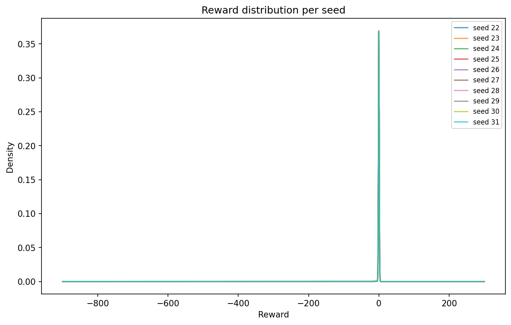
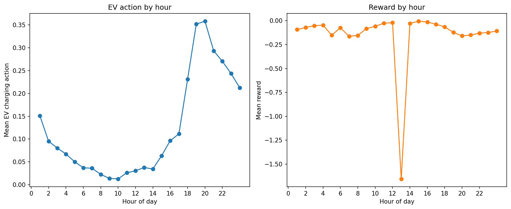
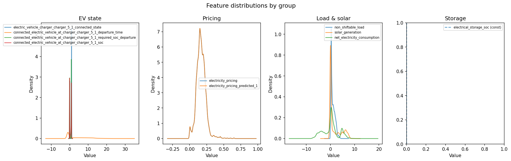
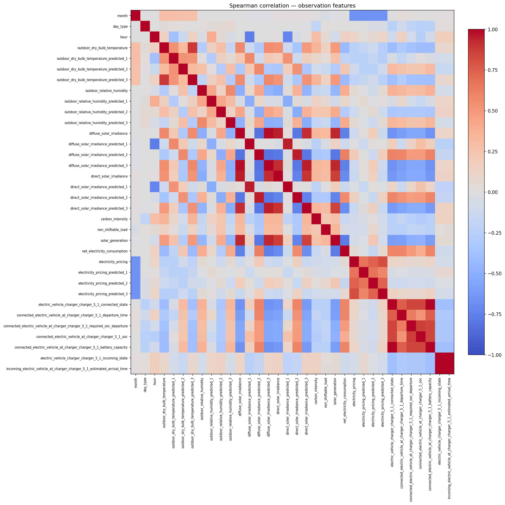
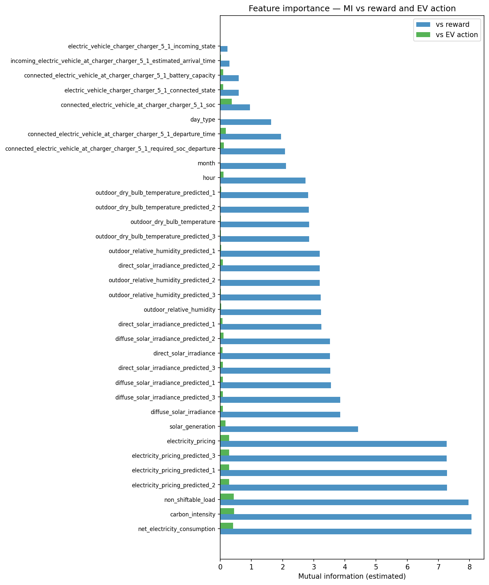
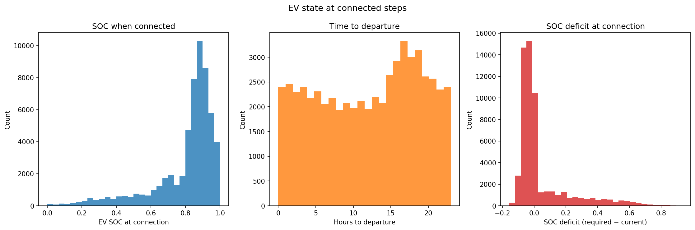

# Offline RL for EV Charging — Implementation Notes

These notes document the full implementation of an iterative offline RL pipeline for EV charging control on Building 5 in the CityLearn environment. The idea is to train an agent that improves on a hand-crafted rule-based controller, using only pre-collected data — no live environment interaction during training.

---

## The setup

CityLearn simulates 17 buildings in a shared grid. Each building has an EV charger and a stationary battery. The learned agent controls Building 5 only; the other 16 are always driven by the rule-based controller (RBC) at evaluation time.

This single-building scope has an important implication: even a perfect Building 5 controller only affects 1/17 of the district. Any building-level improvement gets diluted ~17× at the district level, so the evaluation target is Building 5 performance, not district performance.

KPIs are CityLearn's normalised values — lower is better, 1.0 = no-control baseline. The primary metrics are `cost_total`, `carbon_emissions_total`, and `annual_normalized_unserved_energy_total`. Unserved energy is a hard constraint: every EV that connects must be fully charged by departure.

---

## The pipeline

The approach is iterative:

1. Collect transitions from a behaviour policy.
2. Stamp each transition with a calibrated reward.
3. Train a cloning agent (BC) — sanity check and imitation baseline.
4. Train an offline RL agent (IQL) on the same data.
5. Benchmark both against the behaviour policy.
6. Optionally swap in the best IQL agent as the new behaviour policy and repeat.

The reward is calibrated once on the first dataset and then frozen for all subsequent experiments. This keeps the yardstick consistent across iterations.

---

## Step 1 — Behaviour policy and data collection

The behaviour policy is a hand-crafted RBC for EV charging. It charges when solar generation exceeds building load (PV-bonus mode), applies an emergency top-up when departure is imminent and SOC is critically low, and is otherwise idle. It never uses the stationary battery. Deliberately narrow — a better policy has obvious room to improve.

**The namespace bug.** The first smoke run tripped a fail-fast assertion: both action columns were constant zero. The RBC was never actually charging anything. The root cause: the RBC reads EV observation fields by bare names (e.g. `connected_state`), but CityLearn namespaces them by charger ID (e.g. `electric_vehicle_charger_charger_5_1_connected_state`). Every lookup silently returned a default, and the EV branch was never entered.

A wrapper (`OfflineRBC`) was written that remaps bare names to namespaced keys before deferring to the parent. After the fix: 18% PV-bonus, 1% emergency, 81% idle — non-trivial distribution, zero unserved energy across all rollouts. Without this fix, every downstream benchmark would have been comparing learned agents against a do-nothing baseline.

**Dataset:** 10 seeds (22–31) × 8,759 steps = 87,590 transitions as parquet (11 MB). 35 observation features, 2 action dimensions, mirrored next-observation block. Stationary battery action is constant zero throughout — asserted at collection time.

---

## Step 2 — Reward calibration

CityLearn's native reward doesn't align with the KPIs we care about. The calibrated reward is a five-term weighted sum: cost, carbon, peak demand, ramping, and unserved energy — all non-positive, so the reward is always ≤ 0.

Weights were fit by non-negative least squares (NNLS) across the 10 RBC rollouts, targeting Spearman ρ ≥ 0.90 between cumulative reward and district KPIs. Final ρ = **0.927** (p = 0.0001).

**The collinearity problem.** Raw NNLS zeroed out `peak` and `ramp` weights. The reason: across ten RBC seeds, these KPIs vary little and move together with cost — classic multicollinearity. NNLS simply drops the redundant terms. A reward that ignores peak and ramping was exactly the failure mode the pipeline was designed to avoid.

The fix: a hybrid floor rule — where NNLS gives a positive weight, use it; where it gives zero, substitute the design-doc default expressed in standardised space (so the peak:cost = 2:1 ratio is preserved on a per-σ scale). `unserved` is fixed at 50.0 regardless (no RBC signal to fit). The chosen rule is recorded per term in `reward_weights.json` — if a future behaviour policy generates enough variance to make NNLS separate peak/ramp, those entries flip automatically.

**Final frozen weights:** cost=0.050, carbon=0.056, peak=0.025, ramp=0.0017, unserved=50.0.

---

## Step 3 — Behaviour cloning

BC trains a supervised MLP to predict RBC actions from observations. Serves two purposes: (1) sanity check that the dataset and reward are trainable, (2) imitation baseline that any value-based agent must beat.

**Architecture:** hidden=[256,256], dropout=0.1, tanh output, 5 seeds × 150 epochs, best checkpoint by validation MSE.

**Results — Building 5:**

| KPI | RBC | BC | Δ |
|---|---:|---:|---:|
| `cost_total` | 2.730 ± 0.081 | 2.645 ± 0.059 | **−0.085** |
| `carbon_emissions_total` | 2.683 ± 0.073 | 2.609 ± 0.053 | **−0.074** |
| `electricity_consumption_total` | 2.660 ± 0.079 | 2.577 ± 0.059 | **−0.083** |
| `unserved_energy` | 0 | 0 | 0 |

BC beats its own teacher by ~3% on Building 5 cost, with tighter std. This mild improvement from noise reduction via supervised learning sets the floor that IQL must exceed. District-level KPIs are within 1σ of RBC — success criterion met.

---

## Step 4 — Implicit Q-Learning

IQL was chosen because it avoids querying out-of-distribution actions during training — the core challenge of offline RL. The idea: instead of learning a policy by searching for maximising actions (which requires querying states never seen in the dataset), IQL learns a value function that only evaluates actions that actually appear in the data, then extracts a policy by upweighting those transitions where the dataset action was better than average.

In practice, three networks are trained jointly:
- A **value network** that estimates expected return at each state (trained with an asymmetric loss that makes it slightly optimistic — biasing the policy toward higher-return actions)
- **Twin Q-networks** that estimate action-value, bootstrapped with the value network rather than maximising over actions (this is what avoids OOD queries)
- A **policy network** trained by advantage-weighted regression: transitions where the action was above-average get higher weight, below-average get lower weight

**Hyperparameters:** expectile τ=0.7, advantage temperature β=3.0, clip=100, γ=0.99, lr=3e-4, batch=256, hidden=[256,256], dropout=0.1, 150,000 gradient steps. Architecture matches BC for controlled comparison.

**Run-001 results — Building 5:**

| KPI | RBC | BC | IQL | Δ (IQL−RBC) |
|---|---:|---:|---:|---:|
| `cost_total` | 2.730 ± 0.081 | 2.645 ± 0.059 | **2.634 ± 0.051** | **−0.096** |
| `carbon_emissions_total` | 2.683 ± 0.073 | 2.609 ± 0.053 | **2.600 ± 0.046** | **−0.083** |
| `electricity_consumption_total` | 2.660 ± 0.079 | 2.577 ± 0.059 | **2.568 ± 0.050** | **−0.092** |
| `unserved_energy` | 0 | 0 | 0 | 0 |

IQL beats both RBC and BC on every Building 5 KPI. The cost improvement over RBC (Δ/σ_RBC ≈ 1.2) clears the >1σ bar. The policy is more consistent than RBC (lower std), and zero unserved energy holds across all 50 rollouts (5 training × 10 eval seeds). Training was stable throughout — no Q-divergence, advantage clip fraction < 7%.

---

## Step 5 — Behaviour-policy swap

The best IQL agent (run-001/seed 101) replaced the RBC as the data-collection policy. New data collected on seeds 32–41 (disjoint from training and eval seeds). Same frozen reward. IQL run-002 trained on this IQL-generated dataset.

| | run-001 (RBC data) | run-002 (IQL data) |
|---|---:|---:|
| best_val_policy_mse | 0.002182 ± 0.000078 | **0.000158 ± 0.000010** |
| B5 cost_total | **2.634 ± 0.051** | 2.666 ± 0.153 |
| B5 unserved_energy | 0 | 0 |

Training loss improved 13.8× — the policy fits IQL-generated data much more tightly — but Building 5 cost regressed slightly and variance tripled.

**The finding:** dataset diversity beats distribution alignment. The IQL policy is more deterministic than RBC, so the run-002 dataset covers a narrower slice of the state-action space. The policy fits this narrow distribution precisely but generalises less well across the full eval range. The RBC dataset — with its three action modes varying across diverse weather and EV arrival patterns — is informationally richer, despite coming from a worse policy. Replacing RBC data with IQL data threw away useful coverage.

---

## Step 6 — Feature analysis

A full EDA pass on the RBC dataset was run before any further experimentation.

### Dataset at a glance

87,590 transitions, 35 observation features, 2 actions. Stationary battery: constant zero throughout. EV action: 81% idle, 18% PV-bonus, 1% emergency. Reward: always ≤ 0, mean ≈ −0.149, std ≈ 6.4, min ≈ −600 (rare large spikes from unserved-energy penalties).

### Seeds are exchangeable

Reward distributions overlap tightly across all 10 seeds — pooling the dataset is justified, no outlier seed.

### EV charging peaks in the evening

Mean EV charging action peaks around hour 20 (evening EV arrival). Reward varies across the day with electricity pricing and solar generation schedules.

### Feature distributions

EV state features show bimodal distributions driven by connected vs. disconnected states. `obs_electrical_storage_soc` is constant zero (battery never used). Pricing and temperature features are unimodal and smooth.

### Lots of redundancy in forecasts

Price forecast triplets (predicted\_1/2/3) and temperature forecast triplets are near-identical — high correlation clusters visible in the heatmap. These can each be reduced to the current-step value without meaningful information loss.

### What actually matters

Top features predictive of **reward**: `net_electricity_consumption`, `carbon_intensity`, `non_shiftable_load`. Top features predictive of **EV action**: almost the same set. The near-overlap suggests the RBC's action choices are aligned with the reward signal on the most informative features — consistent with its decent performance despite limited grid awareness.

### EV urgency structure

Most EVs connect already nearly full (median SOC deficit ≈ −0.02), with ~13 hours to departure. This explains why emergency mode is rare — most connection events require no urgency. The interesting decisions happen in the minority of cases where `soc_deficit` is genuinely large.

### Proposed derived features

Five features designed for future experiments (not yet in training data):

| Feature | Formula | Why it helps |
|---|---|---|
| `soc_deficit` | `required_soc − ev_soc` | The agent currently must infer this from two separate inputs |
| `time_to_departure` | `(departure_time − hour) mod 24` | Countdown is more learnable than absolute departure time |
| `price_trend` | `pricing_predicted_1 − pricing` | Sign tells the agent whether to charge now or wait |
| `solar_surplus` | `solar_generation − non_shiftable_load` | Net renewables before any grid draw |
| `ev_urgency` | `soc_deficit / max(time_to_departure, 1)` | Required charge rate — the single most compact urgency signal |

---

## Key takeaways

**Validate behaviour first, hard.** A silent observation namespace mismatch made the RBC a do-nothing agent. Without an explicit assertion on action variance, every downstream experiment would have been useless. Positive evidence of correct behaviour is the right standard.

**Reward design needs structural awareness.** NNLS on collinear KPI signals drops terms that are informationally redundant in the training data — regardless of how important they are for the intended objective. The hybrid floor rule fixes this, but the real lesson is to test reward coverage explicitly before training.

**IQL improves over BC — offline RL works on this task.** The improvement is modest (~3.5% on B5 cost) but consistent, statistically significant, and safety-preserving. The policy is also more consistent than its teacher.

**Dataset diversity beats distribution alignment.** Replacing the diverse RBC dataset with narrower IQL-generated data degraded generalisation, despite dramatically lower training loss. For future iterations, mixing data sources rather than replacing is the right approach.

**Single-building scope limits what you can measure.** Any B5 improvement is diluted 17× at the district level. Multi-building extension is needed to make district KPIs a meaningful evaluation target.

---

## What's next

- **Hyperparameter sweep on RBC data** — β ∈ {5, 10} and τ_expectile ∈ {0.8, 0.9} — push further on the original dataset before trying anything more complex
- **Add derived features** — implement the five engineered features above and measure effect on training MSE and eval cost
- **Data mixing** — combine RBC and IQL data rather than swapping to preserve coverage
- **Multi-building IQL** — extend to all 17 buildings to make district-level improvements measurable
